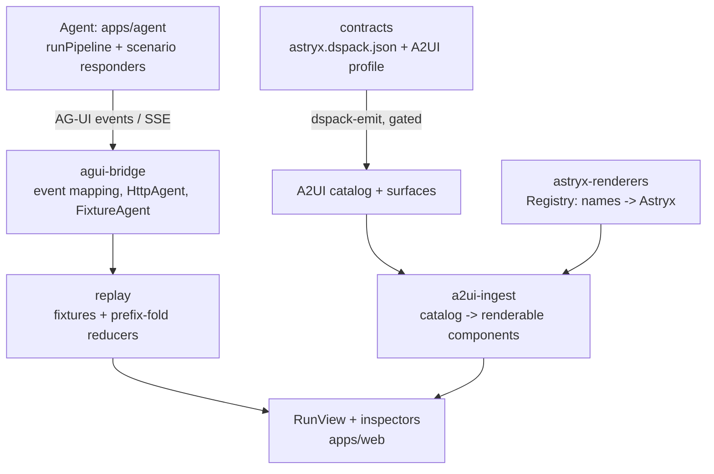

# Contributing

## What this project is

The reference experience for the open AI-native frontend ecosystem: an agent
generates interfaces under a design-system contract ([dspack](https://github.com/aestheticfunction/dspack)),
governed and repaired by [dspack-gen](https://github.com/aestheticfunction/dspack-gen),
compiled to [A2UI](https://github.com/google/A2UI) by
[dspack-emit](https://github.com/aestheticfunction/dspack-emit), streamed over
[AG-UI](https://github.com/ag-ui-protocol/ag-ui), and rendered with
[Astryx](https://github.com/facebook/astryx). Every run — live, replayed, or
imported — is one ordered event list folded by the same reducers.

**Scope boundary:** this repository demonstrates the open-source ecosystem
only. Aesthetic Function's proprietary reconciliation methods (Figma/code/doc
sync, drift detection, write-back) are not included and must not be
reimplemented here.

## Architecture



Layer responsibilities and the design-system swap procedure:
[docs/renderer-abstraction.md](docs/renderer-abstraction.md). Deployment:
[docs/deployment.md](docs/deployment.md). Decision history:
[docs/IMPLEMENTATION_LOG.md](docs/IMPLEMENTATION_LOG.md).

## Local setup

```sh
pnpm install
pnpm build:contracts     # contract -> gated catalogs + scenario surfaces (required once)
pnpm dev                 # studio at :3000 (replay works with no agent)
pnpm --filter agent dev  # the local agent at :8787 ("run it live", interactions)
```

Node ≥ 22, pnpm 10. No keys needed; `ollama:*` model refs use your local
Ollama if present, and "scripted" mode is fully deterministic.

## Tests

```sh
pnpm test                 # package unit tests
pnpm -r typecheck
pnpm e2e                  # builds the static export, runs Playwright against it
```

CI runs all of the above plus contract gates, the sync check against the
authoritative dspack contract, and the Astryx drift check — with zero model
calls. Live-model specs are gated (`RECORD_LIVE=1`, `BENCH=1`) and manual.

## Recording fixtures

Curated fixtures are **recorded real runs** — never hand-scripted content
(`mode: "live"` in the file is the provenance label; `"scripted"` marks
deterministic CI fixtures).

```sh
pnpm --filter agent record -- --model ollama:gpt-oss:latest \
  --prompt "…" --intent destructive-action \
  --id fixture-00N --name "…" --out "$PWD/packages/replay/fixtures/fixture-00N.json" \
  [--require-repair | --require-clean | --allow-failure]
```

Interactive recordings (with HITL round-trips) come from the gated Playwright
recorder: `RECORD_LIVE=1 pnpm exec playwright test generated --grep "record fixture"`.

## Adding a scenario

A scenario is data plus (optionally) a deterministic responder — no UI code:

1. Author a contract surface in `packages/contracts/surfaces/<id>.dsurface.json`
   (it is emitted and gate-checked by `pnpm build:contracts`).
2. If interactive: a responder module in `apps/agent/src/scenarios/` and a
   registration in the server's `SCENARIOS` map; capabilities (exact action
   names + validated component matchers) in `packages/scenarios/src/capabilities.ts`.
3. Register it in `packages/scenarios/src/registry.ts` (fixtures, seed
   prompts, break-it prompts, status).
4. **Governance boundary:** a new contract intent / worked example / rule is
   owner-authored in the dspack repo — propose it, do not add it here.

## Known limitations

- Bound inputs lose focus and un-committed draft text when an A2UI delivery
  lands (the per-delivery remount workaround for the published renderer's
  memoization; measured in docs/IMPLEMENTATION_LOG.md — an upstream fix, not
  a fork, is the path).
- A2UI v1.0 catalogs are emitted and gated but not rendered (no stable v1.0
  renderer exists yet); rendering is v0.9.1.
- The recipe scenario's live-generation path awaits owner-approved contract
  governance; it runs deterministically today.

## Troubleshooting

- **Live tab says the agent is offline** — start it: `pnpm --filter agent dev`.
- **`next dev` crashes with `localStorage.getItem is not a function`** —
  Node ≥ 25 ships a stub Web Storage global; the dev launcher
  (`apps/*/scripts/next-dev.mjs`) adds `--localstorage-file` automatically
  wherever the running Node supports it. Don't bypass the launcher or inline
  the flag in NODE_OPTIONS: Node < 22.4 rejects it with exit 9 before Next
  even starts (that regression is unit-guarded).
- **Blank page / `Cannot find module './NNN.js'` in dev** — a `next build`
  ran while `next dev` was up and corrupted `.next`. Stop dev, `rm -rf
  apps/web/.next`, restart.
- **`build:contracts` fails after editing a surface** — the emitter refused
  it; the error names the node and reason (that refusal class is a feature).
