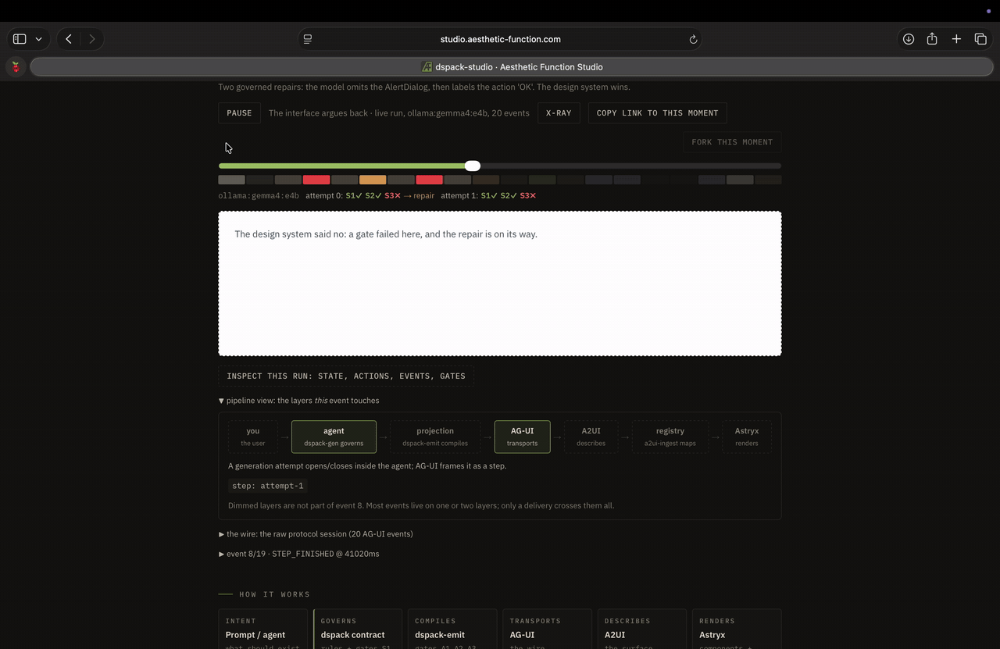

# dspack-studio

The design system governs what the agent ships. An agent proposes an interface; the design system checks it; invalid patterns are explained and repaired, with the rule and its written rationale on the record. dspack-studio is the flagship experience for the open AI-native frontend ecosystem: generation under a dspack contract, streamed over AG-UI as A2UI surfaces, rendered with Astryx. Rewind it, fork it, break it, X-ray it. Every gate, repair, and audit is inspectable.



> Part of the [dspack ecosystem](https://github.com/aestheticfunction) — the organization profile has the full map of how the repositories fit together.
>
> **Kind:** application (pnpm monorepo: static web app + local agent server; not an npm package) · **Audience:** anyone who wants to see contract-governed generation working, and contributors to the studio itself · **Hosted replay:** [studio.aesthetic-function.com](https://studio.aesthetic-function.com) — recorded real runs, session import, and Break-it Mode with no keys or local model; live generation is bring-your-own-machine (below)

Status: MVP experience assembled — replayable recorded runs, live governed
generation, imported sessions, an interactive appointment-booking scenario,
a recipe co-editor with real ingredients and instructions, Break-it Mode
(with recorded catches when no agent is running), and progressive
inspectors. See [docs/AUDIT.md](docs/AUDIT.md) for the plan-vs-implementation
map.

## Try it

```sh
pnpm install
pnpm build:contracts            # contract -> gated A2UI catalogs + scenario surfaces
pnpm dev                        # the studio (replay works with no agent, no keys)
pnpm --filter agent dev         # optional: the local agent for "run it live" + interactions
```

Replay mode needs no keys and no network beyond npm: every curated
generation is a recorded real run (`mode: "live"` in its fixture), and the
interactive catch recordings are deterministic, labeled `mode: "scripted"`
with the authored adapter named. Live mode runs the
governed pipeline on your machine — "scripted" is deterministic; `ollama:*`
uses your local models. `pnpm e2e` drives the whole experience against the
static export (zero model calls).

## What you can do

- **Replay** curated recordings: watch an interface build, scrub it backward,
  inspect every event, gate finding, repair message, and state patch.
- **Run it live**: the pipeline generates under the contract, streams over
  AG-UI, renders through Astryx — then the finished run is instantly
  scrubbable and downloadable as a session fixture.
- **Import a session** someone else downloaded; it replays identically.
- **Book an appointment / co-edit a recipe**: human-in-the-loop actions with
  correlation ids, validated shared state, recoverable rejections. The recipe
  is a real recipe — ingredients and numbered instructions — and a dietary
  constraint rewrites the matching steps, not just the table.
- **Break it on purpose**: pick a failure condition and watch the pipeline
  catch, repair, or refuse — with receipts. Without the local agent, the
  conditions with an equivalent recorded run replay it, labeled as a
  recorded catch; the rest say plainly that they need the agent.
- **Restyle it**: spin one governed surface through the Astryx themes. The
  structure, events, and audit do not change; only the theme does.

## The pipeline

dspack constrains and validates. dspack-emit compiles. AG-UI transports. A2UI describes. Astryx renders.

```
CONTRACT TIME (build/CI, deterministic)
  astryx.dspack.json --dspack-emit--> A2UI catalogs v0.9.1 + v1.0   (gates A1/A2)
                     --dspack-gen---> generation context (prompt + schema + few-shot)
                     --a2ui-ingest--> renderer-registry contract

GENERATION TIME (agent service per prompt, or replayed from fixtures)
  prompt -> dspack-gen runPipeline: adapter -> surface -> S1/S2/S3 -> repair loop
         -> dspack-emit -> A2UI messages (gate A3) -> audit report

RUNTIME (browser)
  AG-UI events (SSE) -> A2UI MessageProcessor -> Astryx registry -> pixels
```

| Layer | Responsibility |
|---|---|
| Agent (`apps/agent`) | Intent routing, governed generation, HITL pauses, data-model patching |
| dspack contract (`packages/contracts`) | Constrain generation, validate S1/S2/S3, carry rationale |
| dspack-emit | Compile contract to catalog, surface to A2UI; gates A1/A2/A3 |
| AG-UI | Transport: lifecycle, tool calls, gate telemetry, state deltas |
| A2UI | Declarative surface, data model, actions |
| Astryx (`packages/astryx-renderers`) | Real components and theming behind catalog names |

## Workspace

| Package | Purpose |
|---|---|
| `apps/web` | The studio: canvas, timeline, X-ray, wire view |
| `apps/agent` | AG-UI agent server wrapping the dspack-gen pipeline |
| `packages/a2ui-ingest` | Generic A2UI catalog to renderer adapter (extracted from dspack-emit's demo) |
| `packages/astryx-renderers` | Catalog names mapped to Astryx components |
| `packages/agui-bridge` | Pipeline events mapped to AG-UI events |
| `packages/contracts` | The astryx dspack contract, catalog emission, drift check |
| `packages/replay` | Recorded-run fixtures, recorder, timeline player, X-ray event-log indexing |
| `packages/scenarios` | Scenario configs: prompts, break-it prompts, fixtures |

## What this is not

This project demonstrates the open ecosystem only: [dspack](https://github.com/aestheticfunction/dspack), [ds-mcp](https://github.com/aestheticfunction/ds-mcp), [dspack-export](https://github.com/aestheticfunction/dspack-export), [dspack-gen](https://github.com/aestheticfunction/dspack-gen), [dspack-emit](https://github.com/aestheticfunction/dspack-emit), with [AG-UI](https://github.com/ag-ui-protocol/ag-ui), [A2UI](https://github.com/google/A2UI), and [Astryx](https://github.com/facebook/astryx). It does not include the Aesthetic Function reconciliation engine.

## License

Apache-2.0
